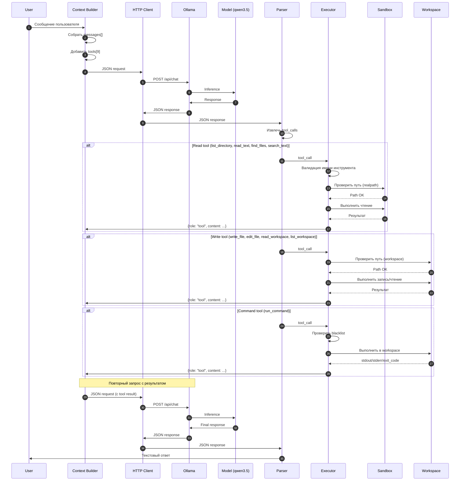
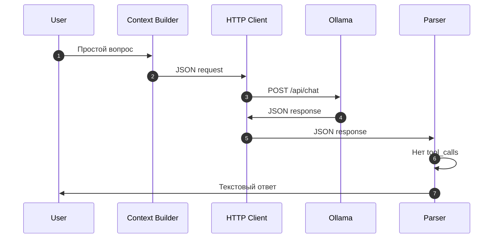
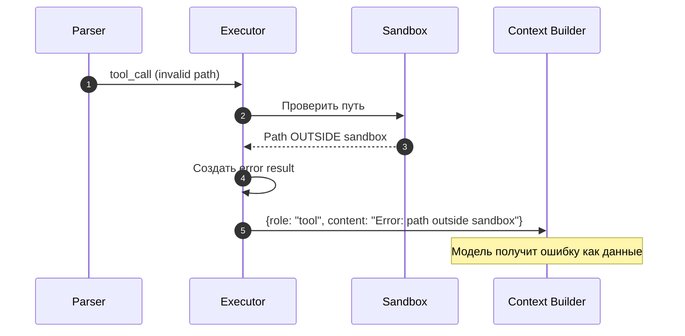

# Sequence Diagram: Request Flow

## Main Flow — запрос с tool call

```mermaid
sequenceDiagram
    autonumber
    participant U as User
    participant CB as Context Builder
    participant HC as HTTP Client
    participant O as Ollama
    participant M as Model (qwen3.5)
    participant P as Parser
    participant E as Executor
    participant S as Sandbox
    participant W as Workspace

    U->>CB: Сообщение пользователя
    CB->>CB: Собрать messages[]
    CB->>CB: Добавить tools[9]
    CB->>HC: JSON request

    HC->>O: POST /api/chat
    O->>M: Inference
    M->>O: Response
    O->>HC: JSON response
    HC->>P: JSON response

    P->>P: Извлечь tool_calls

    alt Read tool (list_directory, read_text, find_files, search_text)
        P->>E: tool_call
        E->>E: Валидация имени инструмента
        E->>S: Проверить путь (realpath)
        S-->>E: Path OK
        E->>S: Выполнить чтение
        S-->>E: Результат
        E->>CB: {role: "tool", content: ...}
    end

    alt Write tool (write_file, edit_file, read_workspace, list_workspace)
        P->>E: tool_call
        E->>W: Проверить путь (workspace)
        W-->>E: Path OK
        E->>W: Выполнить запись/чтение
        W-->>E: Результат
        E->>CB: {role: "tool", content: ...}
    end

    alt Command tool (run_command)
        P->>E: tool_call
        E->>E: Проверить blacklist
        E->>W: Выполнить в workspace
        W-->>E: stdout/stderr/exit_code
        E->>CB: {role: "tool", content: ...}
    end

    Note over CB,O: Повторный запрос с результатом

    CB->>HC: JSON request (с tool result)
    HC->>O: POST /api/chat
    O->>M: Inference
    M->>O: Final response
    O->>HC: JSON response
    HC->>P: JSON response

    P->>U: Текстовый ответ
```

## Simple Flow — прямой ответ без tool call

```mermaid
sequenceDiagram
    autonumber
    participant U as User
    participant CB as Context Builder
    participant HC as HTTP Client
    participant O as Ollama
    participant P as Parser

    U->>CB: Простой вопрос
    CB->>HC: JSON request
    HC->>O: POST /api/chat
    O->>HC: JSON response
    HC->>P: JSON response
    P->>P: Нет tool_calls
    P->>U: Текстовый ответ
```

## Error Flow — ошибка в Executor

```mermaid
sequenceDiagram
    autonumber
    participant P as Parser
    participant E as Executor
    participant S as Sandbox
    participant CB as Context Builder

    P->>E: tool_call (invalid path)
    E->>S: Проверить путь
    S-->>E: Path OUTSIDE sandbox
    E->>E: Создать error result
    E->>CB: {role: "tool", content: "Error: path outside sandbox"}

    Note over CB: Модель получит ошибку как данные
```
